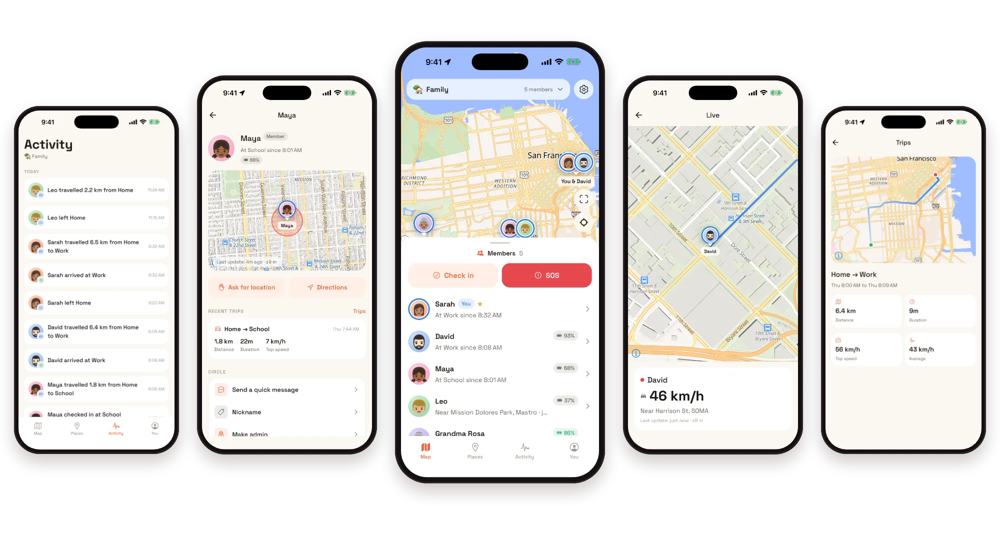
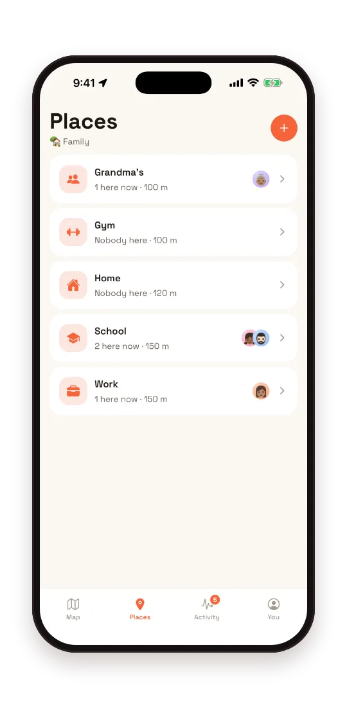
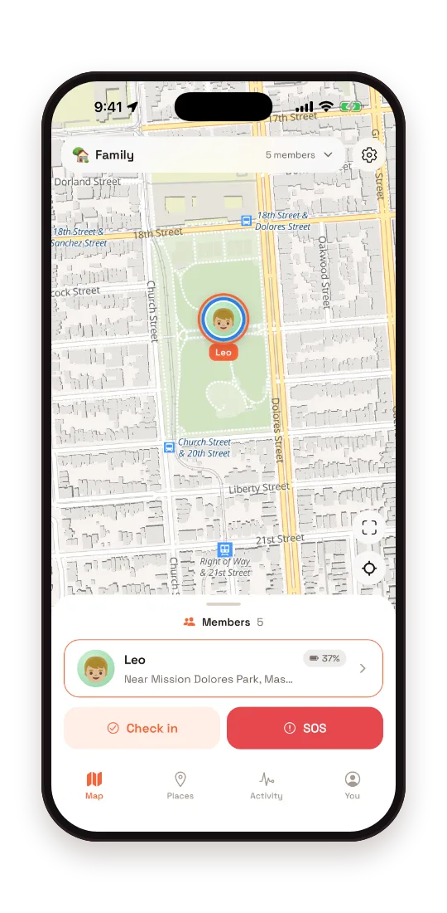
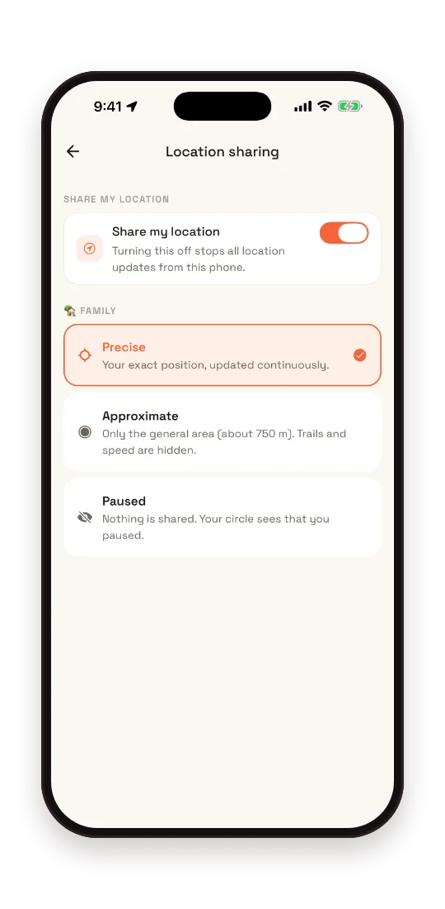

<p align="center">
  
</p>

<h1 align="center">Hearth</h1>

<p align="center">
  <b>Family safety you host yourself.</b><br>
  Know where your family is. Nobody else does.
</p>

<p align="center">
  <a href="CHANGELOG.md"></a>
  <a href="LICENSE"></a>
  <a href="https://github.com/Qureshi-DH/hearth/actions/workflows/ci.yml"></a>
  
  
  
</p>

<p align="center">
  <a href="docs/docs/overview/quick-start.md">Quick start</a> ·
  <a href="docs/docs/install/self-hosting.md">Self-hosting</a> ·
  <a href="docs/docs/developer/architecture.md">Architecture</a> ·
  <a href="docs/docs/privacy.md">Privacy</a> ·
  <a href="docs/docs/roadmap.md">Roadmap</a>
</p>

<p align="center">
  <picture>
    <source media="(prefers-color-scheme: dark)" srcset=".github/assets/hero-dark.webp">
    
  </picture>
</p>

Commercial family safety apps keep every position, arrival and drive on their
own servers, under a privacy policy you don't control. Hearth runs on yours.
No company account, no analytics, no ads, and nothing is sent to us.

It's two pieces: an API server that runs in Docker next to Postgres, and an iOS
and Android app that talks only to it.

## Status

1.0. The features below are built and tested, and I run it for my own family.
It has not been through an independent security audit, and the Android build
has had less real device testing than iOS. The iOS and Android apps are built
and tested and waiting on App Store and Play Store review, so they're coming
soon. Until they're out you build the app yourself. Read
[SECURITY.md](SECURITY.md) before pointing the server at the internet.

## What it does

<table>
  <tr>
    <td align="center" width="33%">
      <br>
      <b>Places</b><br>
      Arrivals and departures, without asking
    </td>
    <td align="center" width="33%">
      <br>
      <b>SOS and check-ins</b><br>
      One press reaches the whole family
    </td>
    <td align="center" width="33%">
      <br>
      <b>Sharing</b><br>
      Precise, approximate or paused, per circle
    </td>
  </tr>
</table>

- **Live map.** Everyone in your circle, with battery and how they're moving.
- **Places.** Hear when someone arrives at or leaves home, school or work.
- **Live drives.** Follow a drive as it happens, a fix a second while you watch.
- **SOS and check-ins.** One press alerts the whole family, and pausing can't block it.
- **Crash alerts.** Optional. The phone asks first, and silence raises the alarm.
- **Trips.** Distance, time and top speed for every journey.
- **Sharing your way.** Precise, approximate (750 m) or paused, per circle.
- **Your data.** Export it, erase your history, or delete your account from the app.

How each of these works: [safety](docs/docs/safety.md), [privacy](docs/docs/privacy.md),
[architecture](docs/docs/developer/architecture.md).

## Try it

You need Docker and about five minutes. The server is published as
`dhqureshi/hearth-api` for amd64 and arm64, so running Hearth needs no clone at
all. The [self-hosting guide](docs/docs/install/self-hosting.md) has the compose file and the
`.env` to paste.

From a clone, which builds the image from your working tree instead of pulling
it:

```bash
git clone https://github.com/Qureshi-DH/hearth.git
cd hearth
cp .env.example .env
```

Open `.env` and set six things:

```bash
JWT_SECRET=$(openssl rand -base64 48)   # paste the output
PUBLIC_URL=https://hearth.example.com   # where phones will reach you
ADMIN_EMAIL=you@example.com             # your account
ADMIN_PASSWORD=a-long-passphrase        # at least 10 characters
POSTGRES_PASSWORD=$(openssl rand -hex 24)
S3_SECRET_ACCESS_KEY=$(openssl rand -hex 24)
```

Compose refuses to start until the last two are set, so there is no default
database password to forget about.

Then:

```bash
docker compose up -d
curl localhost:4000/readyz     # {"ok":true}
open http://localhost:4000/docs
```

Set the admin before the first boot. It is created once, on an empty database,
and everyone else needs an invite, so nobody who finds the URL can claim your
server.

Phones won't talk to a plain HTTP server in the background, so put a TLS proxy
in front before you invite anyone. [docs/docs/install/self-hosting.md](docs/docs/install/self-hosting.md)
has Caddy and nginx configs you can paste.

## Build the app

The store builds are in review and not out yet. The app uses native modules for
maps and background location, so Expo Go won't run it and you need a
development build.

```bash
pnpm install
cd apps/mobile
npx expo prebuild
npx expo run:ios        # or run:android
```

Enter your server's address on first launch. In a development build the field is
pre-filled with whichever machine is running Metro.

## Develop

```bash
pnpm install
createdb hearth_dev
cp .env.example .env          # set DATABASE_URL and JWT_SECRET

pnpm dev                      # API on :4000 with hot reload
pnpm seed                     # a demo family with places, trips and history
pnpm dev:mobile               # Expo
```

`pnpm seed` prints four demo accounts and the password they share. One of them
shares approximately, so you can see what the fuzzing looks like.

Before you push:

```bash
pnpm verify   # format, lint, typecheck, test
```

Server tests run against a real Postgres and truncate between specs. Mocking the
database would test almost nothing, since a good deal of the interesting
behaviour is in SQL.

```bash
createdb hearth_test
TEST_DATABASE_URL=postgres://localhost:5432/hearth_test pnpm test
```

## How it's put together

```text
server/            Fastify 5, Drizzle, Postgres. The whole API.
apps/mobile/       Expo SDK 55, React Native, based on Ignite.
packages/shared/   Types, constants, geo maths and the crash heuristic.
                   No runtime dependencies.
deploy/            Reverse-proxy examples.
web/               The landing page. Static, no build step.
docs/              Everything below.
```

`packages/shared` is consumed as TypeScript source by both sides, so if a
response shape changes, both fail to typecheck until they agree.

## Documentation

The docs are at [qureshi-dh.github.io/hearth/docs](https://qureshi-dh.github.io/hearth/docs/),
with search, and the same pages are in [`docs/docs`](docs/docs) here.

|                                                               |                                                    |
| ------------------------------------------------------------- | -------------------------------------------------- |
| [Quick start](docs/docs/overview/quick-start.md)              | From nothing to one phone on the map               |
| [Self-hosting](docs/docs/install/self-hosting.md)             | Deploy, TLS, backups, upgrades, scaling            |
| [Remote access](docs/docs/install/remote-access.md)           | Reaching your server from outside the house        |
| [Push notifications](docs/docs/install/push-notifications.md) | Every option for self-hosters, with the tradeoffs  |
| [Architecture](docs/docs/developer/architecture.md)           | Data model, location pipeline, realtime, jobs      |
| [API](docs/docs/developer/api.md)                             | REST and websocket reference                       |
| [Mobile](docs/docs/developer/mobile.md)                       | Building the app, permissions, background location |
| [Privacy](docs/docs/privacy.md)                               | What's stored, for how long, who can see it        |
| [Roadmap](docs/docs/roadmap.md)                               | What's next                                        |
| [Contributing](CONTRIBUTING.md)                               | Setup and conventions                              |

## Push notifications, briefly

Waking a sleeping phone needs Apple's or Google's push service, so that last hop
is the one part a self-hoster can't fully own. Pick a provider:

| Provider         | Third party?        | Works on                     | Effort |
| ---------------- | ------------------- | ---------------------------- | ------ |
| `none` (default) | No                  | Both, while the app is open  | None   |
| `ntfy`           | No, you host it     | Both, alerts only, in ntfy   | Low    |
| `expo`           | Yes, Expo relays it | Both, including silent wakes | Low    |
| `webpush`        | Browser vendor      | Browsers, UnifiedPush        | Medium |

Only `expo` wakes the app itself, and a lot rests on that: Live and a refresh on
a parked Android phone, the wake that revives a phone gone quiet, and "Ask for
location" on a phone in a pocket. `ntfy` carries the alerts, and those wait for
the phone's own next report, up to a quarter of an hour.

Expo push goes through the Expo project, Firebase project and Apple push key the
app was built with. If you have those, build the app with them and push works
fully against your server. If you don't, Hearth still runs, with `ntfy` for
alerts. A Hearth organisation with its own accounts, so the store builds can
push for any server, is on the [roadmap](docs/docs/roadmap.md) and needs
funding. Payloads carry names and identifiers, never coordinates. The
[push notifications guide](docs/docs/install/push-notifications.md) covers each one.

## Contributing

Issues and pull requests are welcome. [CONTRIBUTING.md](CONTRIBUTING.md) covers
setup and the handful of conventions that matter, mostly around privacy and the
database.

If you find a security problem, please report it privately. See
[SECURITY.md](SECURITY.md).

## License

[AGPL-3.0](LICENSE). Run it, change it, share it. If you offer it to other
people as a service, share your changes too. The parts that started as
somebody else's work are listed in
[THIRD_PARTY_NOTICES.md](THIRD_PARTY_NOTICES.md).
